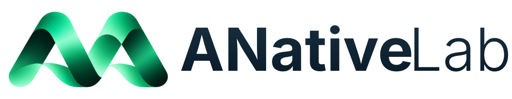

    <picture>
      <source media="(prefers-color-scheme: light)" srcset="../assets/logo-dark.svg">
      <source media="(prefers-color-scheme: dark)" srcset="../assets/logo-light.svg">
      
    </picture>

<h4><b>ANative Lab — the AI-Native and Agent-Native Intelligence Laboratory — advances AI-native research paradigms, agent-native systems, self-evolving intelligence, and autonomous scientific discovery.
We build systems designed from the ground up around autonomous, collaborative agents, explore intelligence that reorganizes itself and improves continuously through experience, and create agentic scientists that collaborate with humans to expand the frontier of knowledge.
Our mission is to shape a future through AI-native research, where agent-native intelligence evolves autonomously and continuously, empowers human innovation, and accelerates scientific discovery.</b></h4>

  <a href="https://anative.ai/"><picture>
    <source media="(prefers-color-scheme: light)" srcset="../assets/website-button-light.svg">
    <source media="(prefers-color-scheme: dark)" srcset="../assets/website-button-dark.svg">
    
  </picture></a>&nbsp;&nbsp;<a href="https://anative-lab.github.io/EvoAgentX/"><picture>
    <source media="(prefers-color-scheme: light)" srcset="../assets/evoagentx-button-light.svg">
    <source media="(prefers-color-scheme: dark)" srcset="../assets/evoagentx-button-dark.svg">
    
  </picture></a>

---

| Repository | Description |
| ---------- | ----------- |
| [**EvoAgentX**](https://github.com/ANative-Lab/EvoAgentX) | Open-source self-evolving agent framework — builds multi-agent workflows from natural-language goals, then executes, evaluates, and iteratively optimizes them. |
| [**Awesome-Self-Evolving-Agents**](https://github.com/ANative-Lab/Awesome-Self-Evolving-Agents) | A comprehensive survey of self-evolving AI agents — a new paradigm bridging foundation models and lifelong agentic systems. |
